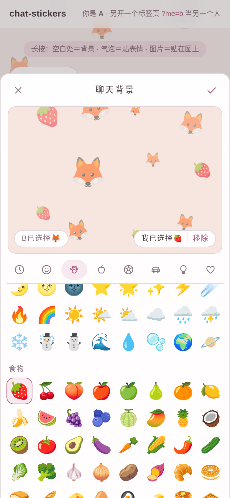
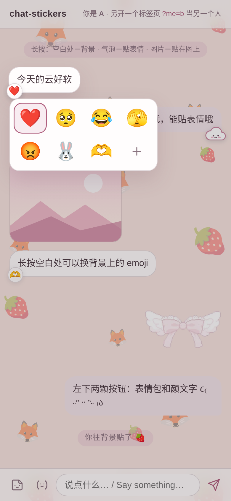
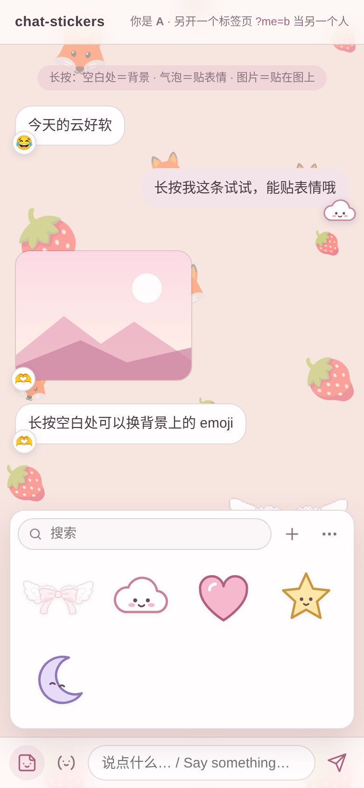
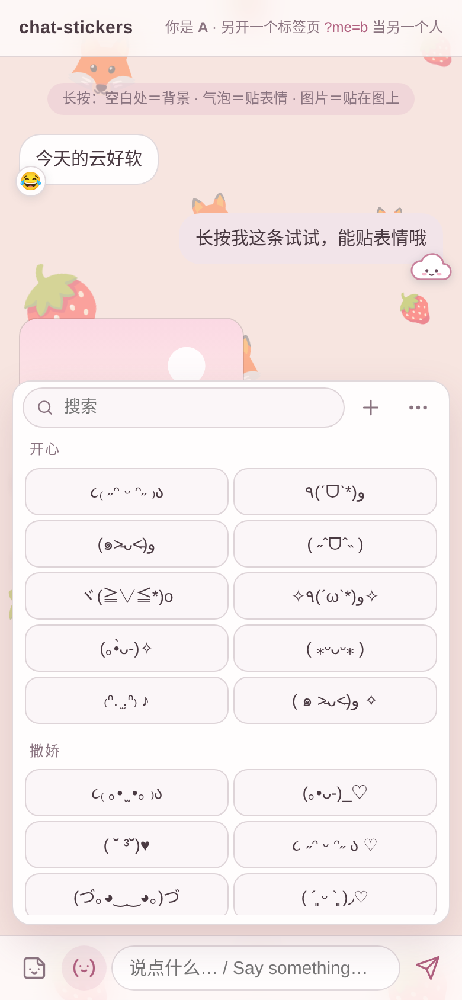

# cute-chat-stickers

给聊天页加三样「贴」——贴背景 emoji、长按给气泡贴表情、自己的表情包库（外加一个颜文字小抽屉）。
**长按落在哪，就往哪贴：** 按在空白处贴到聊天背景上，按在气泡上贴到那条消息上，按在图片上贴到那张图上。
零依赖，一个 `<script>` 接上就能用。

*[English below](#english)*

| 长按空白 → 背景 | 长按气泡 → 贴表情 | 表情包抽屉 | 颜文字抽屉 |
|---|---|---|---|
|  |  |  |  |

## 三步接入

**1. 引进来**

```html
<link rel="stylesheet" href="dist/chat-stickers.css">
<script src="dist/chat-stickers.js"></script>
```

**2. 你的聊天页只要长这样**：一个滚动的消息列表，每行带 `data-id`，气泡是 `.bubble`（选择器都能改）；输入框旁边放两颗按钮。

```html
<div id="messages">
  <div class="row" data-id="m1"><div class="bubble">今天的云好软</div></div>
</div>
<form id="composer">
  <button type="button" id="stickerBtn" class="cs-entry"><!-- 你的 SVG --></button>
  <button type="button" id="kaomojiBtn" class="cs-entry"><!-- 你的 SVG --></button>
  <input id="input">
</form>
```

**3. 初始化，接上后端**

```js
ChatStickers.init({
  container: "#messages",
  me:     { id: "a", name: "A", emoji: "🐰" },
  others: [{ id: "b", name: "B", emoji: "🦊" }],
  api: "/chat-stickers",                        // 参考后端的前缀，见 server/
  headers: () => ({ "X-User": currentUserId }),  // 你的鉴权
  stickers: { button: "#stickerBtn", anchor: "#composer", input: "#input", send: (text) => sendMessage(text) },
  kaomoji:  { button: "#kaomojiBtn", anchor: "#composer", input: "#input" },
});
// 渲染消息时把 [[sticker:名字]] 换成图：
StickerRender.into(bubbleEl, message.text);
```

后端二选一：`server/fastapi_example.py`（全部接口：背景状态、贴表情、表情包、颜文字、导入、SSE），或 `packages/stickers/serve.py`（只有表情包＋颜文字，纯标准库）。接口契约见 [`server/PROTOCOL.md`](server/PROTOCOL.md)，鉴权由你决定。

本地先试：`python3 -m http.server` 在仓库根目录跑起来，打开 `demo/index.html`，再开一个标签页 `demo/index.html?me=b` 当另一个人（两个标签页之间用 BroadcastChannel 模拟服务器）。

## 长按三分法

一套长按识别（`packages/core/press.js`），三个落点：

| 按在 | 打开 | 贴到 |
|---|---|---|
| 列表空白处（列表本身，或一行的空白边） | 聊天背景面板：两人各选一枚 emoji，一起撒满背景 | 聊天背景（两边同步） |
| 文字气泡 | 两行四格：❤️ 🥺 😂 🫣 😡 🐰 🫶 ＋ | 那条消息的角上（＋ 打开表情包，贴一张图也行） |
| 图片 | 同一个格子（或你自己的 `onMedia`） | 那张图的角上 |

真机上踩过的坑都在里面：用 touch 事件计时（iOS 一认出长按就发 `pointercancel`）；touchstart / touchmove 全是 passive、从不 `preventDefault`（否则 WebKit 上整根手指滚不动）；挪动超过 8px 或列表一滚就作废；弹出后吞掉 iOS 抬指补发的那个 click；桌面按住鼠标或右键也行。

## 配置

`ChatStickers.init(options)` —— 四样都可以单独传 `false` 关掉。

| 选项 | 默认 | 说明 |
|---|---|---|
| `container` | — | 消息列表（元素或选择器），长按在这里识别 |
| `me` / `others` | — | `{ id, name, emoji }`，emoji 是背景上的默认那枚 |
| `bubble` / `media` | `".bubble"` / `"img, video, .media"` | 什么算气泡、什么算图片 |
| `api` | `null` | 参考后端前缀；不给就用各自的 `store` / `adapter` |
| `headers` | `null` | 对象或返回对象的函数，每个请求都带上 |
| `events` | `api + "/events"` | SSE 地址；你有自己的推送就设 `null`，自己调 `EmojiBg.apply` / `setReactions` |
| `longPressMs` | `500` | 长按多久算数 |
| `lang` | 跟浏览器 | `"zh"` / `"en"`，文案都能用 `labels` 覆盖 |
| `background` | `{}` | 传给 `EmojiBg.init` 的额外选项 ↓ |
| `reactions` | `{}` | 传给 `Reactions.init` 的额外选项 ↓ |
| `stickers` / `kaomoji` | `{}` | 传给 `StickerPanel.init` / `KaomojiBox.init` ↓ |

`EmojiBg`（聊天背景）

| 选项 | 默认 | 说明 |
|---|---|---|
| `cellSize` / `densityPerScreen` | `124`（手机）/ `170`（宽屏） | 一格至多一枚；也可以直接说「一屏大约几枚」 |
| `mix` | `{ day: .12, night: .06 }` | 底色往两枚 emoji 的平均色走多少，发灰的颜色自动少染 |
| `seed` | `""` | 撒法是确定性的（两枚 emoji ＋ 格数 ＋ seed），同尺寸的两台设备看到一样的底 |
| `isNight` | `data-cs-theme` 或系统深色 | 夜里 emoji 更淡 |
| `enabled` | 永远开 | 比如只在某些房间开：`() => room === "x"`，变了调 `EmojiBg.refresh()` |
| `adapter` | HTTP / localStorage | `{ load, save, subscribe }`，想接别的存储就自己写 |
| `insertBefore` | `<body>` 第一个孩子 | 背景层插在哪；你的应用根节点给 `position:relative; z-index:1` 和透明背景 |

聊天流里的系统小灰条：`EmojiBg.notice({ who, emoji, prev })` 返回一个节点——「B 往背景贴了🦊 贴一个」。

`Reactions`（气泡贴表情）：`emojis`（前七格）、`more`（第八格 ＋）、`getId(el)`、`canReact(el, id)`、`actions`（格子下面加几行自己的菜单，图标请用 SVG）、`bubbleOf(id)`、`store: { react, subscribe }`。`Reactions.paint(bubble, values)` 画角标。

`StickerPanel`（表情包抽屉）：`button`、`anchor`、`input`、`send(text)`、`api` 或 `store`。点一张＝发送（输入框里已经有字就插到光标处）。

`KaomojiBox`（颜文字抽屉）：`button`、`anchor`、`input`、`api` 或 `store` / `seedUrl`。点一条＝插到光标处，不发送。

## 表情包库

```sh
export STICKER_DIR=~/my-stickers            # 或者每条命令加 --dir
python3 packages/stickers/sticker.py add ~/Downloads/dizzy.png 兔子晕倒 "转圈圈倒下" 兔子,晕
python3 packages/stickers/sticker.py list 兔
python3 packages/stickers/sticker.py edit 兔子晕倒 --name 晕倒兔 --desc "新描述" --tags 兔子,晕
python3 packages/stickers/sticker.py rm 晕倒兔
python3 packages/stickers/serve.py 8765    # 最小服务：列表 / 出图 / 增改删
```

- 消息里写 `[[sticker:名字]]`（`[[表情:名字]]`、`[[sticker:12]]` 也认），`StickerRender` 把它换成图；整条只有一张图时气泡让位。
- 每张有稳定编号，删了不复用；**改名字时文件跟着改，旧名字留进 `aliases`**，历史消息里的旧名照样出图。
- 抽屉顶栏 ＝ 搜索 ＋ 添加 ＋ 更多：「…」→「整理」或长按 / 右键某一格选中它，顶栏变成「修改 · 删除」。格子只管挑，不挂按钮。
- `index.json` 的格式见 `packages/stickers/index.schema.json`。
- **库里放你自己的图。** 仓里只带了一张示例贴纸 `sample-bow.webp`（「蝴蝶结」）。网上收来的表情包版权不在你手里，请别随仓发布。

## 颜文字

- 内置九组：开心 / 撒娇 / 委屈 / 生气 / 害羞 / 装死 / 猫 / 兔 / 花边（`packages/kaomoji/kaomoji.json`，`૮₍ ｡• ̫ •｡ ₎ა`、`໒꒱`、`( ⸍›̥̥̥ ᜊ ‹̥̥̥ ⸌)` 这一路）。增改删和表情包一样。
- **支持粘贴任意颜文字网页**：「…」→「从网页导入」，贴网址 → 后端抓公开页面（10 秒超时、2MB 上限、拒绝内网地址）→ 按通用规则挑出候选 → 你勾选、归组 → 存进来，每条记下 `source`。没有为哪个站写死解析。
- **同步**：「…」→「导入来源」→「同步」，同一个网址再抓一次，只端出新出现的；你存过、改过的一条不动。来源存在 `kaomoji-sources.json`，可删。
- **去重**：每条颜文字存一个 `key`（NFKC → 去掉空白、零宽字符、变体选择符 → 全角标点转半角），key 一样才算重复，不做模糊相似。导入预览里已经有的标「已有」、灰掉、不勾；同一页里 key 相同的只留第一条；手动添加撞上了会提示「添加失败···ᴛ ω ᴛ已经有类似的啦」，并把已有那条高亮、滚过去。
- 实测两个颜文字站（2026-09-28）：fontsby.com/kaomoji 页面 517 张卡片，认出 491 张，误抽 0；漏掉的 18 张里 13 张是纯 ASCII（`^_^`、`UwU`…），另外 5 张带 3 个以上汉字 / 谚文或像单词的字母串。utilitytools.net/text/kaomoji 的主列表是脚本渲染的，HTML 里只有说明区的 32 个示例，认出 27 个，误抽 0，漏的 5 个都是纯 ASCII。纯 ASCII 的请手动添加。
- 命令行：`sticker.py kaomoji list | add | edit | rm | import <url> [--all] | sources`。

## 单独引

每一件都能单独用，`packages/core` 是它们共用的底：

| 目录 | 内容 |
|---|---|
| `packages/core/` | `press.js` 长按三分法 · `drawer.js` 抽屉底座（增改删、搜索、表单）· `theme.css` 样式变量 · `index.js` 总入口 |
| `packages/emoji-bg/` | 聊天背景（`EmojiBg`） |
| `packages/reactions/` | 长按贴表情格子（`Reactions`） |
| `packages/stickers/` | 表情包：`sticker.py` CLI、`serve.py`、`render.js`、`panel.js`、示例库 |
| `packages/kaomoji/` | 颜文字抽屉（`KaomojiBox`）和内置颜文字 |
| `server/` | `fastapi_example.py` 参考后端、`PROTOCOL.md` 接口契约 |
| `demo/` | 假对话页，四样都能试 |
| `docs/` | 截图、GitHub Pages 落地页、分享卡片 |

比如只要表情包：`core/theme.css` ＋ `core/drawer.css` ＋ `core/press.js` ＋ `core/drawer.js` ＋ `stickers/*`。改了 `packages/` 后跑 `./build.sh` 重新拼 `dist/`。

## 分享卡片（封面）

- `docs/og.png`（1280×640）是 `docs/og.html` 截出来的。
- **仓库直链也带封面**：GitHub 仓库 → Settings → General → Social preview → Edit → Upload an image，选 `docs/og.png`。
- GitHub Pages：Settings → Pages → Source 选 `main` 分支的 `/docs`。仓名定了以后把 `docs/index.html` 里 `og:image` / `og:url` 的 `https://Anko3o.github.io/cute-chat-stickers/` 换成真地址。

## 许可证

MIT。见 `LICENSE`。

## 致谢

聊天背景的玩法参考了小红书 2026-09 的聊天背景功能。

---

<a id="english"></a>

# cute-chat-stickers (English)

Three ways to *stick* things in a chat page — emoji on the chat background, reactions on bubbles, and your own sticker shelf (plus a little kaomoji drawer).
**Long-press where you want it to stick:** empty space → the background, a bubble → that message, an image → that picture.
Zero dependencies; one `<script>` and it works.

## Three steps

1. Include `dist/chat-stickers.css` and `dist/chat-stickers.js`.
2. Have a scrolling message list whose rows carry `data-id` and whose bubbles are `.bubble` (all selectors are configurable), and two buttons next to your input.
3. Call `ChatStickers.init({ container, me, others, api, headers, stickers: {…}, kaomoji: {…} })` and point `api` at a backend: `server/fastapi_example.py` (everything, with SSE) or `packages/stickers/serve.py` (stickers and kaomoji only, standard library). The contract is in [`server/PROTOCOL.md`](server/PROTOCOL.md); authentication is up to you.

Try it locally: run `python3 -m http.server` at the repo root, open `demo/index.html`, and `demo/index.html?me=b` in a second tab to play the other person (the tabs sync through BroadcastChannel).

## One long-press, three landing spots

| Press on | Opens | Sticks to |
|---|---|---|
| empty space in the list | the background sheet: each person picks one emoji, both are scattered across the background | the shared chat background |
| a text bubble | a 2 × 4 grid: ❤️ 🥺 😂 🫣 😡 🐰 🫶 + | that message's corner (+ opens your stickers) |
| an image | the same grid (or your `onMedia`) | that picture's corner |

Lessons from real phones are built in: touch events for timing (iOS cancels pointer events when it recognises its own long-press), passive listeners with no `preventDefault` on touchstart/touchmove (WebKit would stop scrolling), cancel after 8 px of movement or any scroll, swallow the synthetic click iOS sends on finger-up, and mouse-hold or right-click on desktop.

## Options

See the tables in the Chinese section above — option names are the same. The short version:
`EmojiBg`: `cellSize` / `densityPerScreen`, `mix: {day, night}` (how far the page tints towards the emojis' average colour), `seed` (layout is deterministic, so two same-sized screens match), `isNight`, `enabled`, `adapter: {load, save, subscribe}`, `insertBefore`. `EmojiBg.notice({who, emoji, prev})` gives you the "B added 🦊 to the background · Add yours" line.
`Reactions`: `emojis`, `more`, `getId`, `canReact`, `actions` (SVG icons only), `bubbleOf`, `store: {react, subscribe}`; `Reactions.paint(bubble, values)` draws the chips.
`StickerPanel`: `button`, `anchor`, `input`, `send(text)`, `api` or `store`. Tap sends (or inserts at the caret if you're mid-sentence).
`KaomojiBox`: `button`, `anchor`, `input`, `api` or `store` / `seedUrl`. Tap inserts at the caret, never sends.

## Sticker shelf

`packages/stickers/sticker.py` (`add / list / edit / desc / rm`, folder from `--dir` or `$STICKER_DIR`) and `serve.py` (list, image, add, edit, delete). Write `[[sticker:name]]` in a message (`[[表情:name]]` and `[[sticker:12]]` work too). Numbers are stable and never reused; **renaming keeps the old name in `aliases`** so old messages still show the picture. The drawer's top bar is search + add + more; "…" → Organize (or long-press / right-click a cell) turns it into Edit · Delete. Cells only pick. Put **your own pictures** in the library: the repo ships one sample sticker, `sample-bow.webp`. Stickers collected from the internet aren't yours to publish.

## Kaomoji

Nine built-in groups in `packages/kaomoji/kaomoji.json`. **Paste any kaomoji web page**: "…" → Import from a web page → the backend fetches the public page (10 s timeout, 2 MB cap, private addresses refused) → a generic rule picks candidates → you tick the ones you want and file them under a group → they're saved with their `source`. No site-specific parsing. **Sync** re-imports the same URL and only offers what's new; nothing you saved or edited is touched. Sources live in `kaomoji-sources.json` and can be deleted. **Dedup**: each kaomoji stores a `key` (NFKC → strip whitespace, zero-width characters and variation selectors → full-width punctuation to half-width); equal keys mean duplicate, nothing fuzzy. In the import preview the ones you have are marked and greyed out; same-key repeats on a page keep only the first; a manual add that clashes shows a note and jumps to the existing one. Pages whose list is rendered by JavaScript only expose what's in their HTML, and pure-ASCII faces (`^_^`) are never picked up — add those by hand. CLI: `sticker.py kaomoji list | add | edit | rm | import <url> [--all] | sources`.

## Social preview

`docs/og.png` (1280×640) is a screenshot of `docs/og.html`. Upload it in the repo's Settings → General → Social preview so plain github.com links get the card too. For GitHub Pages, publish `/docs` from `main`, then replace `https://Anko3o.github.io/cute-chat-stickers/` in `docs/index.html`.

## License

MIT. See `LICENSE`.

## Acknowledgements

The chat-background idea follows Xiaohongshu's chat background feature (September 2026).
